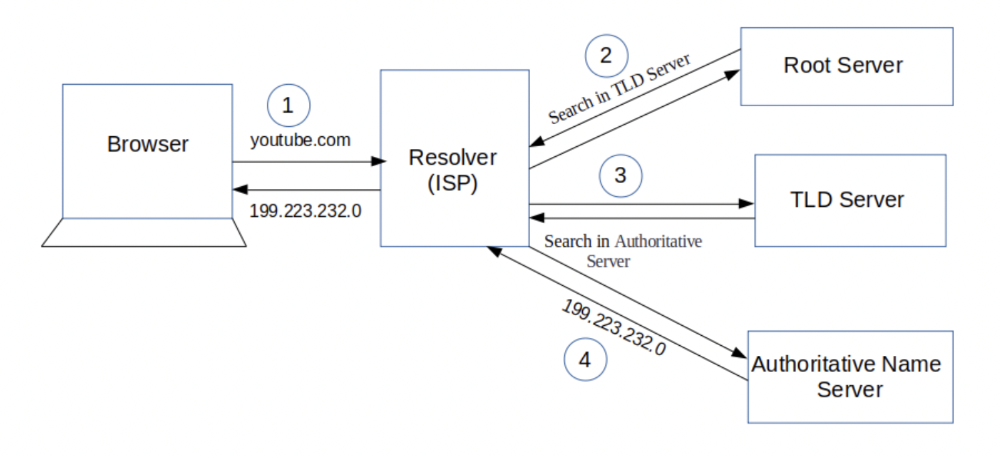

# How browser works under the hood

## Websites, servers, IP addresses

Websites are collections of files like HTML, CSS, Javascript, and images, that tell your browser how to display the site, images, and data. They need to be accessible to anyone from anywhere at anytime, so hosting them on your computer at home isn’t be scalable or reliable. An external computer connected to the Internet, called a server, stores these files.

When you point your browser at a URL like https://chinmay.dev/hello-world, your browser has to figure out which server on the Internet is hosting the site. It does this by looking up the domain, chinmay.dev, to find the address.

Each device on the Internet — servers, cell phones, all have a unique address called an IP address. An IP address contains four numbered parts:

123.0.113.0

But numbers like this are hard to remember! That’s where domain names come in. chinmay.dev is much easier to remember than 123.0.113.0.113.0

## The process flow

## 1. You type https://chinmay.dev/hello-world in your browser and press Enter

Let’s break down the parts of this URL.

https://chinmay.dev/hello-world

- Scheme
  https:// is the scheme. HTTPS stands for Hypertext Transfer Protocol Secure. This scheme tells the browser to make a connection to the server using Transport Layer Security, or TLS. TLS is an encryption protocol to secure communications over the Internet. With HTTPS, the data exchanged between your browser and the server, like passwords or credit card info, is encrypted. You may have also seen ftp://, mailto://, or file://. These are other protocols that browsers know how to handle.

- Domain
  chinmay.dev is the domain name of the site. It is the memorable address and points to a specific server’s IP address

- Path
  Sometimes there is an additional path to the resource in the URL. For example, for this URL,https://jennapederson.dev/the-path-to/hello-world, the-path-to is the path on the server to the requested resource, hello-world. You can think of this like the directory structure of files and other directories on your computer. It’s a way to organize your resources, whether they are static HTML, CSS, Javascript, or image files, or dynamically generated content.

## 2. Browser looks up IP address for the domain

After you’ve typed the URL into your browser and pressed enter, the browser needs to figure out which server on the Internet to connect to. To do that, it needs to look up the IP address of the server hosting the website using the domain you typed in. It does this using a DNS lookup.

Because DNS is complex and has to be blazingly fast, DNS data is cached at different layers between your browser and at various places across the Internet. Your browser checks its own cache, the operating system cache, a local network cache at your router, and a DNS server cache on your internet service provider (ISP). If the browser cannot find the IP address at any of those cache layers, the DNS server at your ISP does a recursive DNS lookup. A recursive DNS lookup asks multiple DNS servers around the Internet, which in turn ask more DNS servers for the DNS record until it is found.

## 3. Browser initiates TCP connection with the server

Using the public Internet routing infrastructure, packets from a client browser request get routed through the router, the ISP, through an internet exchange to switch ISPs or networks, all using transmission control protocol, more commonly known as TCP, to find the server with the IP address to connect to. But this is a very roundabout way to get there and it’s not efficient.

Instead, many sites use a content delivery network, or CDN, to cache static and dynamic content closer to the browser eg. Cloudfront.

A CDN is a globally distributed network of caching servers that improve the performance of your site or app (the origin) by bringing the content closer to your users.

Once the browser finds the server on the Internet, it establishes a TCP connection with the server and if HTTPS is being used, a TLS handshake takes place to secure the communication. 

## 4. Browser sends the HTTP request to the server
Now that the browser has a connection to the server, it follows the rules of communication for the HTTP(s) protocol. It starts with the browser sending an HTTP request to the server to request the contents of the page. The HTTP request contains a request line, headers (or metadata about the request), and a body. The request line contains information that the server can use to determine what the client (in this case, your browser) wants to do.

The request line contains the following:

- a request method, which is one of GET, POST, PUT, PATCH, DELETE, or a handful of other HTTP verbs
- the path, pointing to the requested resources
- the HTTP version to communicate with

The next part of the request is the request headers. Headers pass extra information along from the client that help route the request, indicate what type of client is making the request (the user agent), and can be used for supporting A/B testing, blue/green deployments, and canary deployments.
Headers are key-value pairs like "Accept : */*"

## Server processes request and sends back a response
The server takes the request and based on the info in the request line, headers, and body, decides how to process the request. For the request, GET /about-us/ HTTP/1.1, the server gets the content at this path, constructs the response and sends it back to the client. The response contains the following:

a status line, telling the client the status of the request
response headers, telling the browser how to handle the response
the requested resource at that path, either content like HTML, CSS, Javascript, or image files, or data
The status line contains both the HTTP version and a numeric and text representation of the status of the request.

The browser considers a status code in the 200s to be successful. The response was 200, so the browser knows to render the response.
Resources can be static files, either text (i.e index.html) or non-text data (i.e. logo.img). Browsers aren’t always requesting static files, though. Often, these are dynamic resources generated at the time of the request and there is no file associated with the resource. In fact, in this request, that’s exactly what is happening. There is no file hello-world, but the server still knows how to process the request. The server generates a dynamic resource, building the HTML from fragments or templates and combining it with dynamic data to send back in the response, as text, so the browser can render the page.
Now that you know how the server builds the response to send back to the browser, let’s take a look at how the browser handles the response.

## 6. Browser renders the content
Once the browser has received the response from the server, it inspects the response headers for information on how to render the resource. The Content-Type header above tells the browser it received an HTML resource in the response body. The browser knows what to do with HTML!
The first GET request returns HTML, the structure of the page. But if you inspect the HTML of the page (or any web page) with your browser’s dev tools, you’ll see it references other Javascript, CSS, image resources and requests additional data in order to render the web page as designed.
As the browser is parsing and rendering the HTML, it is making additional requests to get Javascript, CSS, images, and data